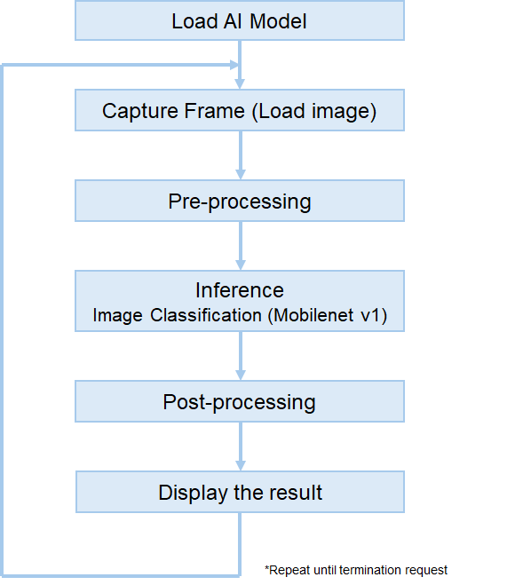

# RUHMI Framework AI Model Compiler for RZ/G3E

[](LICENSE.md)
[](install/readme.md#host-environment-setup)
[](#quick-start)
[](#project-status)

RUHMI (Robust Unified Heterogeneous Model Integration) provides an AI model compiler workflow for Renesas RZ/G3E.  
This repository includes installation assets, model deployment scripts, and application examples.

## Project Status

This repository is actively being prepared.  
Some documents and assets are still in progress and may change.

## Overview

RUHMI Framework provides tools to compile machine learning models into deployment artifacts compatible with RZ/G3E.

The AI compiler stack is powered by EdgeCortix MERA.

## Workflow

Model preparation and deployment scripts are available in this repository.



## Quick Start

The fastest path to first output is:

1. Prepare Ubuntu 22.04 (native Linux or WSL).
2. Create and activate a Python virtual environment.
3. Install the host MERA package and required Python packages.
4. Place a source model in `source_model_files`.
5. Run `scripts/deploy.py` to generate deploy artifacts.
6. Run `scripts/gen_ref_data.py` to create reference input/output binaries.

Example host setup:

```bash
python3.10 -m venv host_env
source host_env/bin/activate
python -m pip install --upgrade pip
python -m pip install install/mera-2.5.0+pkg.3782-cp310-cp310-manylinux_2_27_x86_64.whl
python -m pip install tensorflow
python -m pip install ethos-u-vela==4.0.0
```

For full details, see the [Installation Guide](install/readme.md).

## Repository Layout

- `install/`: compiler/runtime wheel files and installation notes
- `scripts/`: model deployment and reference data generation scripts
- `application_examples/`: sample applications for RZ/G3E
- `docs/assets/`: images used by documentation

## Application Examples

- [Image Classification](application_examples/image_classification/README.md)
- [Face Detection](application_examples/face_detection/README.md)

## Supported Embedded Platforms

- Renesas MPU RZ/G3E

## License

See [LICENSE.md](LICENSE.md).
