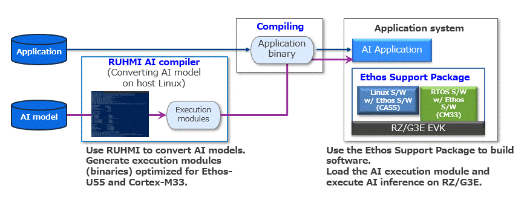

# RUHMI Framework AI Model Compiler for RZ/G3E

[](LICENSE.md)
[](install/README.md#host-environment-setup)
[](#quick-start)
[](#project-status)

RUHMI (Robust Unified Heterogeneous Model Integration) provides an AI model compiler workflow for Renesas RZ/G3E.  
This repository includes installation assets, model deployment scripts, and application examples.

## Overview

RUHMI Framework provides tools to compile machine learning models into deployment artifacts compatible with RZ/G3E.

The AI compiler stack is powered by EdgeCortix MERA.

## Workflow

This repository provides the guidance for how to use RUHMI AI model compiler. Also provides some application examples with the the guidance for how to run on EK-RZ/G3E board.



## Quick Start

The fastest path to first output is:

1. Build the RUHMI Docker image from `scripts/Dockerfile`.
2. Run the container with a host workspace mounted to `/shared`.
3. Place one or more `.tflite` models in the mounted workspace.
4. Run `generate-model-data.py` in the container to compile models and generate I/O binaries.

Build image:

```bash
docker build \
  --build-arg UID=$(id -u) \
  --build-arg GID=$(id -g) \
  -t ruhmi-env \
  -f scripts/Dockerfile \
  scripts
```

Run container:

```bash
docker run --rm -it \
  -v /path/to/work:/shared \
  -w /shared \
  ruhmi-env
```

Generate model data:

```bash
python3 /generate-model-data.py \
  -d models_to_deploy \
  -m model_1.tflite model_2.tflite
```

For full details, see:
- [scripts/README.md](scripts/README.md)
- [Dockerfile guide](docs/dockerfile.md)
- [generate-model-data guide](docs/generate-model-data.md)

## Repository Layout

- `application_examples/`: runnable sample apps and app-specific docs for RZ/G3E
- `docs/`: supporting documentation and documentation assets
- `install/`: MERA/RUHMI install artifacts (wheel files, shared libraries) and setup guide
- `scripts/`: Docker build environment and model data generation script
- `requirements-host.txt`: host-side Python dependency list
- `README.md`: repository entry point
- `LICENSE.md`: license terms

## Application Examples

- [Image Classification](application_examples/image_classification/README.md)
- [Face Detection](application_examples/face_detection/README.md)

## Supported Embedded Platforms

- Renesas MPU RZ/G3E

## License

See [LICENSE.md](LICENSE.md).


[def]: doc/as
