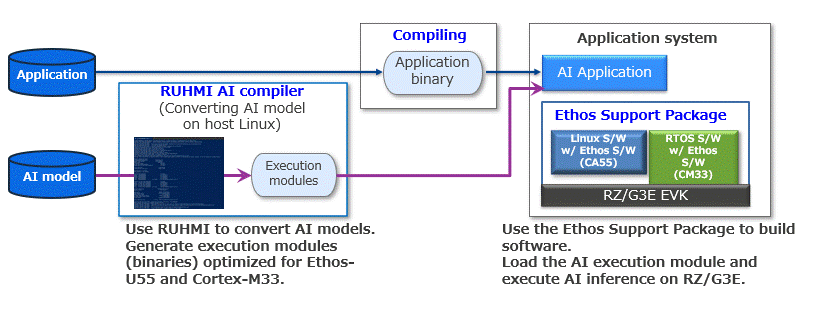

# RUHMI Framework AI Model Compiler for RZ/G3E

RUHMI (Robust Unified Heterogeneous Model Integration) provides an AI model compiler workflow for Renesas RZ/G3E.  
This repository includes installation assets, model compilation scripts, and application examples.

## Overview

RUHMI Framework provides tools to compile machine learning models into deployment artifacts compatible with RZ/G3E.

The AI compiler stack is powered by EdgeCortix® MERA™.

## Workflow

This repository provides the guidance for how to use RUHMI AI model compiler. Also provides some application examples with the the guidance for how to run on EK-RZ/G3E board.

## Supported Embedded Platforms
- Renesas MPU RZ/G3E

## Supported AI model
- TensorFlow Lite/INT8

> [NOTE]
> The current version is the 1st release of RHUMI for RZ/G3E. The supported AI model is limited within **16MB**.

## Installation and compilation
1. Build the envronment and install RUHMI AI model compiler  
- [Use Dockerfile](docs/dockerfile.md)  
2. Cimpilae tha target model
- [Use the compilation Script](docs/generate-model-data.md)

This repository provide the simpliped expanation. You can also refer to [Renesas Rz/G3E NPU(Ethos0U55) SUpport](https://renesas-rz.github.io/rz-ethos-u-docs/).

## Application Examples
- [Common preparation to run](application_examples/README.md)
- [Image Classification](application_examples/image_classification/README.md)
- [Face Detection](application_examples/face_detection/README.md)

## Repository Layout
- `application_examples/`: runnable sample apps and app-specific docs for RZ/G3E
- `docs/`: supporting documentation and documentation assets
- `install/`: MERA/RUHMI install artifacts (wheel files, shared libraries) and setup guide
- `scripts/`: Docker build environment and model data generation script
- `requirements-host.txt`: host-side Python dependency list
- `README.md`: repository entry point
- `LICENSE.md`: license terms

## Neeccsary software 
The generated binary with RUHMI AI model copiler works on [RZ/G3E Ethos Support Package](https://www.renesas.com/ja/software-tool/rzg3e-ethos-support-package).
You need to get the software package from Renesas.com.

## License
See [LICENSE.md](LICENSE.md).

