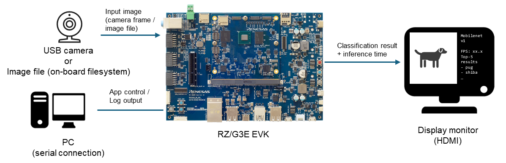
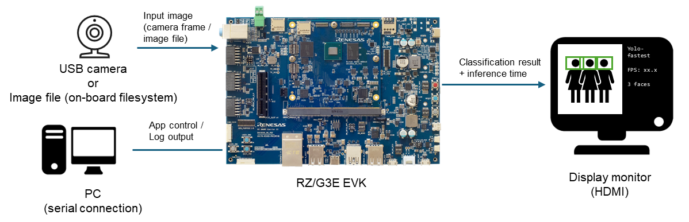

# RZ/G3E Application Examples

This directory contains sample AI applications for Renesas RZ/G3E using the RUHMI AI Framework runtime.

## Included Examples

- [Image Classification](image_classification/README.md)
- [Face Detection](face_detection/README.md)

## Repository Scope

This repository currently provides documentation only for the example applications.
Application binaries (`exe/`) and source trees (`src/`) are distributed in the RZ/G3E release package, not in this repository.

## Target Environment

- Board: [RZ/G3E-EVKIT](https://www.renesas.com/en/design-resources/boards-kits/rz-g3e-evkit)
- Software:
  - RZ/G3E Ethos-U Package
  - RUHMI AI compiler artifacts generated on host
- Peripherals:
  - USB camera
  - HDMI display
  - microSD card (optional)

Image classification setup:

Face detection setup:

## Basic Run Flow

1. Obtain the example package that includes `exe/` (and `src/` if build is required).
2. Copy `exe/` assets to the board.
3. Run in `USB` mode or `IMAGE` mode on the board.
4. Verify FPS and inference result output in console.
