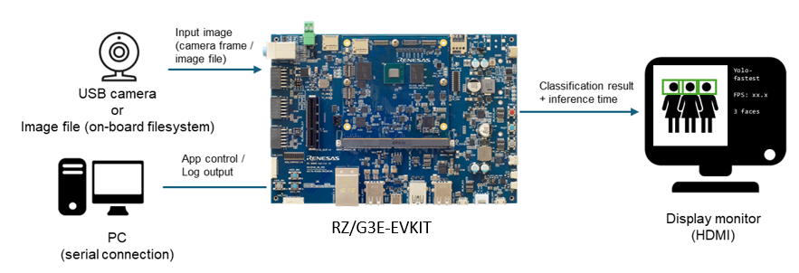
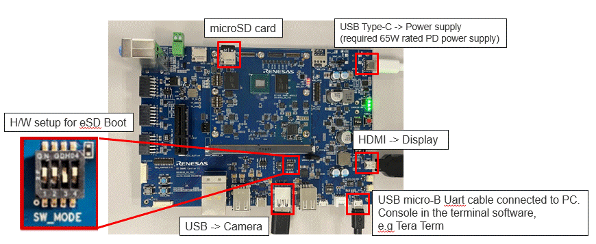
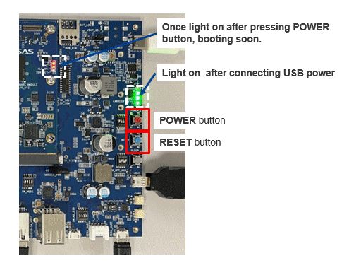

# RZ/G3E Application Examples

This directory contains sample AI applications for Renesas RZ/G3E using the RUHMI AI Framework runtime.

The guidance below uses the pre-buld binaries to run the application. The software package providing the pre-build binaries can be downloaded from [RZ/G3E Ethos Support Package](https://www.renesas.com/en/software-tool/rzg3e-ethos-support-package).
also, in case you build the envronment by yourself on RZ/G3E-EVKIT, you need to get [RZ/G3E Ethos Support Package](https://www.renesas.com/en/software-tool/rzg3e-ethos-support-package). You can also refer to the [Renesas Rz/G3E NPU(Ethos0U55) SUpport](https://renesas-rz.github.io/rz-ethos-u-docs/) for more detail understanding. 


## Included Examples
- [Image Classification](image_classification/README.md)
- [Face Detection](face_detection/README.md)

## Target Environment

- Board: [RZ/G3E-EVKIT](https://www.renesas.com/en/design-resources/boards-kits/rz-g3e-evkit)
- Software:
  - RZ/G3E Ethos-U Package
  - RUHMI AI compiler artifacts generated on host
- Peripherals:
  - USB camera
  - HDMI display
  - microSD card (optional)

Image classification setup:


Face detection setup:



# How to Run the Application Example  
This section shows **the common procedure** to run the application example which is provided in the repository.

## 1. Necessary Hardware
Please prepare the following hardware equipment.
| Equipment	| Details |
| --- | ---| 
| RZ/G3E-EVKIT | Evaluation Board Kit for RZ/G3E. Includes the microUSB to serial cable for serial communication. |
| USB Type-C Power Supply | 65W rated PD power supply to power the board.|
| USB Cable Type-C | 65W rated USB Type-C cable used to connect the power supply to the board. |
| HDMI Display | Used to display graphics of the board |
| HDMI to microHDMI Cable | Used to connect the HDMI display to the board.|
|MicroSD Card|	Must have over 8GB capacity.|
|SD Card Reader	| Used for setting up microSD card.|
|Linux PC (Ubuntu)|	Optional: Used for setting up microSD card instead of a Windows PC.Recommended: Ubuntu 22.04 LTS (64 bit)|
|Windows PC(optional) |Used for  a serial terminal connection (e.g. TeraTerm) |

The system configuration is here.


## Necessary Software  
This document explains how to run the application with using the pre-build binary provided by [RZ/G3E Ethos v3.0 Prebuilt Binaries](https://www.renesas.com/en/document/sws/rzg3e-ethos-v30-rc1-prebuilt-binaries?r=25612558). After downloading it in your host, you can see the binary files to be stored in SD card for booting used as follows.

```
/Images_RZG3E_v1.0.0  
  /core-image-weston-smarc-rzg3e.rootfs.wic.bmap  
  /core-image-weston-smarc-rzg3e.rootfs.wic.gz  
```

## 2. Prepare SD Card in Linux
This section explains how to prepare SD card for Linux booting on EK-RZ/G3E. Installing the Linux image into SD card as following.

- Connect the SD card to the Linux host PC.  
- Install **bmap-tools** if it is not already installed on the Linux host PC.  

```
user@machine:~/rz-ethos-u$ sudo apt-get update
user@machine:~/rz-ethos-u$ sudo apt-get install bmap-tools
```
- Use **bmap-tool** to write the WIC image to the SD card.  
```
user@machine:~$ sudo bmaptool copy --bmap <artifacts_directory>/core-image-weston-smarc-rzg3e.rootfs.wic.bmap <artifacts_directory>/core-image-weston-smarc-rzg3e.rootfs.wic.gz <device_name>
```

>[NOTE]  
>- `<artifacts_directory>`: Path to binaries  
>- `<device_name>`: SD card device name  


- Confirm data written

```
user@machine:~$ sync
```

- Eject SD card

## 3. Installing Application to Linux system
The application binaries and the generated files by RUHMI AI model compiler are placed in SD card following under Linux file system.

Placing the necessary files into SD card is following.

Mount SD card into Linux system.
```
sudo mkdir /mnt/sd -p
sudo mount /dev/sdb2 /mnt/sd
```
Create the folder for allication files to be placed.
In case follow, the application folder is under *home*.
```
sudo mkdir /mnt/sd/home/app
```

Copy the application files in the folder of *app*.
In this case, there are the application files under *./ruhmi-framework-rzg_test/application_examples/face_detection/exe*.
```
sudo cp ./ruhmi-framework-rzg_test/application_examples/face_detection/exe /mnt/sd/home/app
```

Run the following command to sync the data with memory and to unmount SD card.
```
sync
sudo umount /mnt/sd
sudo eject /dev/sdb
```
## 4. Run the application with Linux on RZ/G3E-EVKIT

### Boot Procedure

**System Configuration**
- HDMI → Display  
- USB → Camera  
- UART cable → PC  
- USB-C → Power supply  


1. Set SW_MODE Switch Bank on the SMARC Carrier Board to eSD Boot.

<div align="center">  
eSD Boot Mode setting  

| Switch | Pin 1| Pin 2| Pin 3 | Pin 4 |
| ---- | ---- | ---- | ---- | ---- |
| SW_MODE | ON | ON | OFF |	ON |
<div align="left">  

2. Insert the flashed SD Card to the uSD0 Card Slot, along with connect Serial and Power.

3. Start up a serial terminal connection (e.g. TeraTerm or Minicom) on Host PC, making sure the correct COM port is used.  

>[Serial settings]  
> Baud rate = 115200  
>Data bits = 8  
>Stop bit = 1  
>Parity = none  
>Flow control = off  

4. Power ON RZ/G3E-EVKIT by pressing the POWER button for at least 1 second.  
**Powering with LED status**  


5. Press any key to stop the U-Boot autoboot.  
This will need to be done within 3 seconds of U-Boot starting.  
If U-Boot attempts to boot, press the RESET button and try again.  

6.	Set up the U-Boot environment.
```
=> env default -a
## Resetting to default environment
=> setenv bootargs 'console=ttySC0,115200 rw rootwait earlycon root=/dev/mmcblk0p2'
=> setenv bootcmd 'mmc dev 0;ext4load mmc 0:2 0x48080000 /boot/Image;ext4load mmc 0:2 0x48000000 /boot/r9a09g047e57-smarc.dtb;booti 0x48080000 - 0x48000000'
=> saveenv
Saving Environment to MMC... Writing to MMC(0)... OK
=>
```

7.	Reboot RZ/G3E-EVKIT by pressing the RESET button.
Since the U-Boot environment is saved, autoboot no longer needs to be stopped in the future.

8.	Once Linux has booted up, login with `root` (no password).
```
Poky (Yocto Project Reference Distro) 5.0.8 smarc-rzg3e ttySC0
smarc-rzg3e login: root
```

### Run the Application Example
You have aleady seen the neccesary files in the syetm after booting from SD card.

```
CD /home/app/exe/
ls 
application binary
```

you can run the command on the terminal console as following.
```
./image_classification USB
```

You can also refer each guidance to run it.
- [Image Classification](image_classification/README.md)
- [Face Detection](face_detection/README.md)

