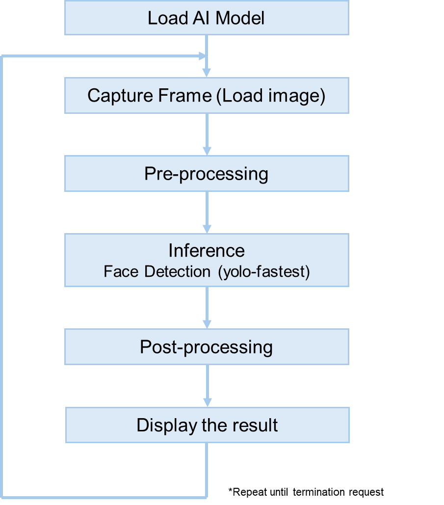

# RZ/G3E Face Detection Application

## Overview

This application performs face detection on RZ/G3E using either a USB camera stream or a still image file.
Detection results are shown on an HDMI display.

The model is compiled with the RUHMI AI Framework and executed with Ethos-U55 acceleration.

## Operation flow


## Target Environment

- Board: RZ/G3E EVK
- Software: RZ/G3E Ethos-U Package (including RUHMI runtime)
- Peripherals:
  - USB camera
  - HDMI display
  - microSD card (optional)

System configuration:


## Directory Structure

```text
.
  README.md
    exe/
    src/
```

`exe/` and `src/` are not included in this repository. Use the RZ/G3E release package for runnable assets.

## Model Information

| Model | Input | Output |
| --- | --- | --- |
| yolo-fastest_192_face_v4.tflite | int8[1,192,192,1] | int8[1,6,6,18], int8[1,12,12,18] |

Reference model source: https://github.com/emza-vs/ModelZoo/tree/master

## Build

Build is required only when `src/` is included in your release package.

1. Install and source the RZ/G3E toolchain environment.
2. Build the application:

```bash
mkdir -p src/build
cd src/build
cmake ..
make
```

Generated binary: `src/build/face_detection`

## Run

Copy files to board:

```bash
scp -r exe/ root@<TARGET_IP>:/home/root/
```

USB camera mode:

```bash
./face_detection USB
```

Image file mode:

```bash
./face_detection IMAGE <path_to_image>
```

Expected output includes model info, FPS, and number of faces detected.

## Notes

- FPS values are reference values only.
- Press `Enter` in the running console to terminate the app.
- Refer to `LICENSE.md` in the repository root for license information.
