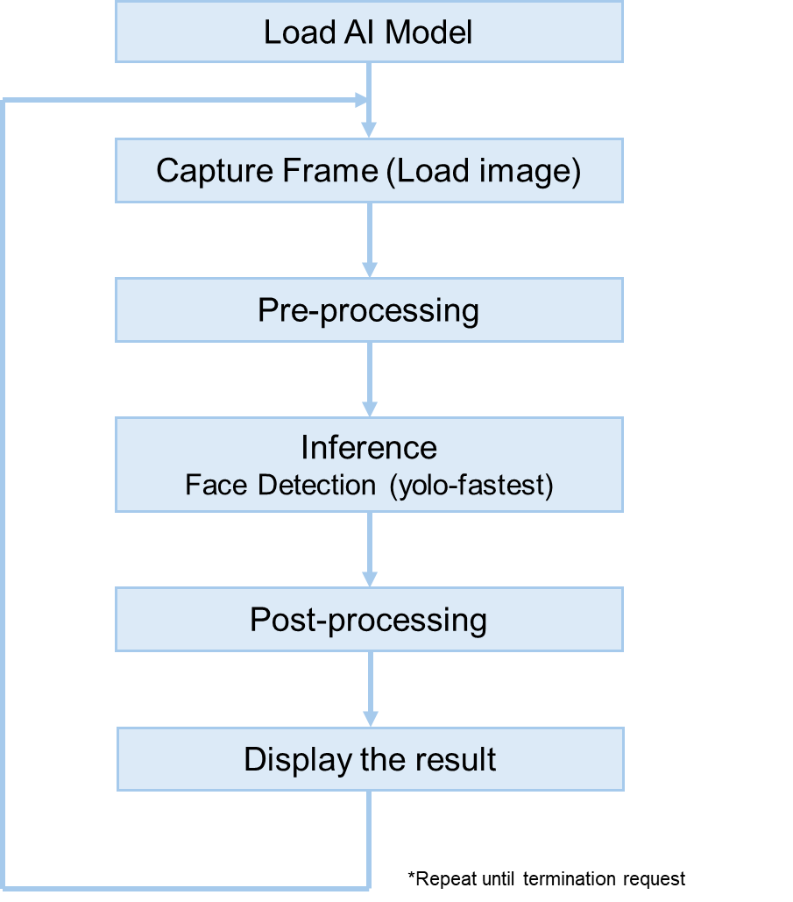

# RZ/G3E Face Detection Application

## Overview

This application performs object detection (face detection) using a YOLO-based AI model. 

The input is either an image file (.jpg/.png) or a USB camera input. The user can specify the input mode (IMAGE/USB). 

The output is displayed on a 1920x1080 HDMI display in a Linux (Wayland) environment on RZ/G3E. 

- IMAGE mode  
FPS: Calculated by running pre-processing, inference, and post-processing 10 times consecutively and averaging the results. 
Bounding boxes: Added to detected faces. 
The number of detected faces is displayed. 

- USB mode  
FPS: The effective frame rate (FPS), including image input, pre-processing, inference, post-processing, and image display, is calculated by averaging 10 frames. 
Bounding boxes: Added to detected faces. 
The number of detected faces is displayed. 

The model is compiled with the RUHMI AI Framework and executed with Ethos-U55 acceleration.

## Operation flow


## Target Environment

- Board: RZ/G3E-EVKIT
- Software: RZ/G3E Ethos-U Package (including RUHMI runtime)
- Peripherals:
  - USB camera
  - HDMI display
  - microSD card (optional)

System configuration:


## Directory Structure

```
.
├── README.md                           // This document
├── exe
│   ├── face_detection                  // Application binary
│   └── model_yolo-fastest              // AI model directory, compiled using the RUHMI AI Framework
│          ├── config.yaml
│          └── yolo-fastest_192_face_v4
└── src	                                // Application source code
```

## Model Information

| AI Model  | Input size  | Output size   |
| ----- | ---------- | ---- |
| [yolo-fastest_192_face_v4.tflite](https://github.com/emza-vs/ModelZoo/tree/master) |  int8 [1,192,192,1] | int8[1,6,6,18]<br>int8[1,12,12,18] |

- [Model reference](https://github.com/renesas/ruhmi-framework-mcu/tree/main/application_examples/face_detection#model-reference)


## Build

Build is required only when `src/` is included in your release package.

1. Install and source the RZ/G3E toolchain environment.
2. Build the application:

```bash
mkdir -p src/build
cd src/build
cmake ..
make
```

Generated binary: `src/build/face_detection`

## Run

Copy files to RZ/G3E-EVKIT:

```bash
scp -r exe/ root@<TARGET_IP>:/home/root/
```

USB camera mode:

```bash
./face_detection USB
```

Image file mode:

```bash
./face_detection IMAGE <path_to_image>
```

Expected output includes model info, FPS, and number of faces detected.

## Notes

- FPS values are reference values only.
- Press `Enter` in the running console to terminate the app.
- Refer to [LICENSE](../../LICENSE.md) in the repository root for license information.
