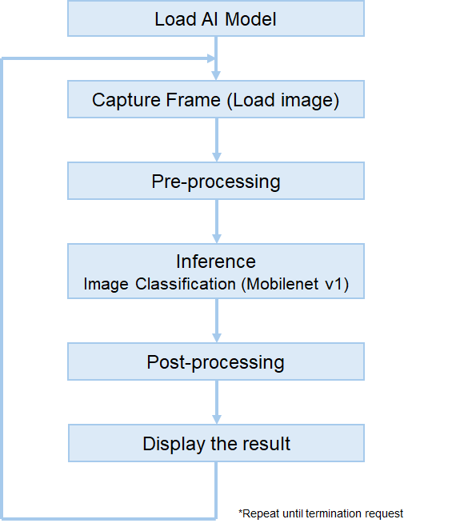
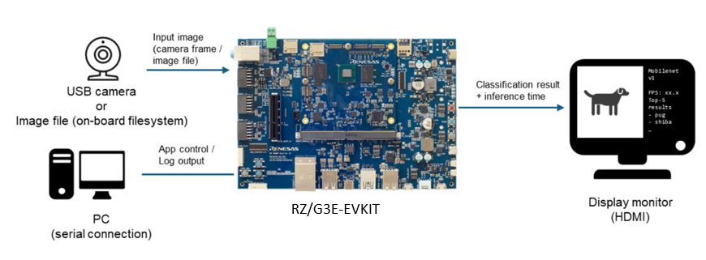

# RZ/G3E Image Classification Application

## Overview

This application performs image classification on RZ/G3E using either a USB camera stream or a still image file.
Results are shown on an HDMI display.

The model is compiled with the RUHMI AI Framework and executed with Ethos-U55 acceleration.



## Target Environment

- Board: RZ/G3E-EVKIT
- Software: RZ/G3E Ethos-U Package (including RUHMI runtime)
- Peripherals:
  - USB camera
  - HDMI display
  - microSD card (optional)

System configuration:



## Directory Structure

```
.
├── README.md                         // This document
├── exe
│      ├── image_classification       // Application binary
│      ├── labels_mobilenet_v1.txt    // Label file for classification results
│      └── model_movilenetv1		      // AI model directory, compiled using the RUHMI AI Framework
│          ├── config.yaml
│          └── mobilenet_v1_0.25
└── src                               // Application source code
```

## Model Information

| AI Model     | Input size            | Output size   |
| ------------ | --------------------- | ------------- | 
| MobileNet V1 |  int8[1, 224, 224, 3] | int8[1, 1000] |

The model outputs classification scores for 1,000 categories.

- [Model reference](https://github.com/renesas/ruhmi-framework-mcu/tree/main/application_examples/image_classification#model-reference)


## Build

Build is required only when `src/` is included in your release package.

1. Install and source the RZ/G3E toolchain environment.
2. Build the application:

```bash
mkdir -p src/build
cd src/build
cmake ..
make
```

Generated binary: `src/build/image_classification`

## Run

Copy files to RZ/G3E-EVKIT:

```bash
scp -r exe/ root@<TARGET_IP>:/home/root/
```

USB camera mode:

```bash
./image_classification USB
```

Image file mode:

```bash
./image_classification IMAGE <path_to_image>
```

Expected output includes model info, FPS, and Top-5 classification results.

## Notes

- FPS values are reference values only.
- Press `Enter` in the running console to terminate the app.
- Refer to [LICENSE](../../LICENSE.md) in the repository root for license information.
