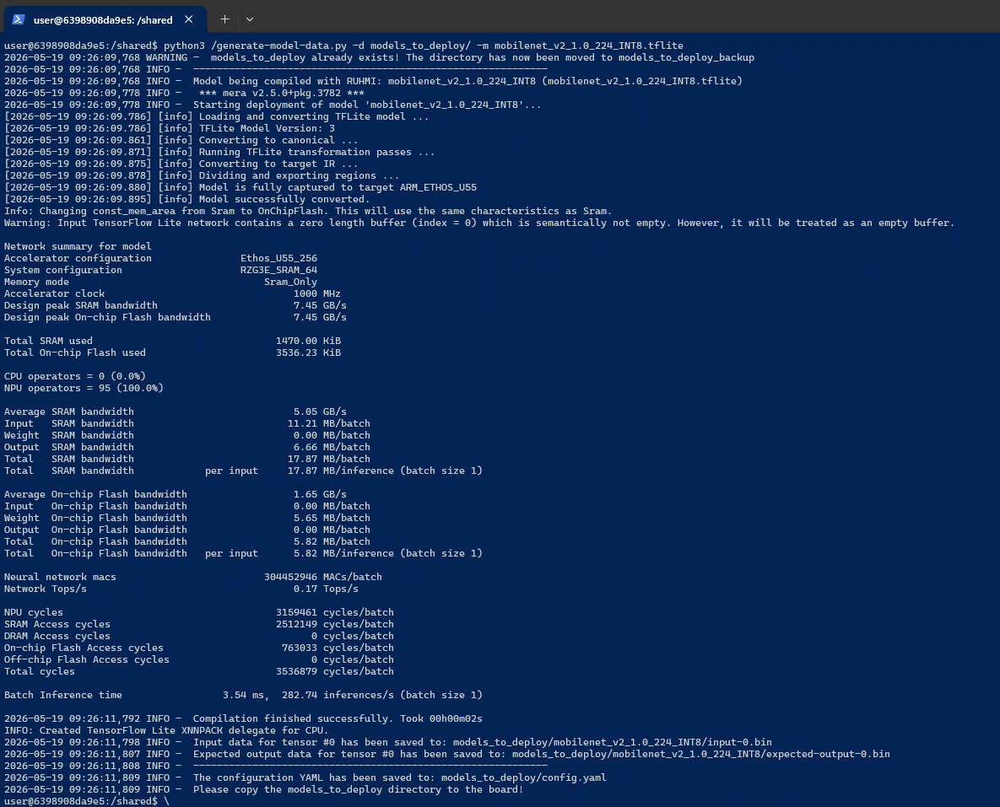

# model compilation script Guide

## Overview
`generate-model-data.py` compiles TFLite model with RUHMI AI model compiler.

1. Copy the model file to the shared directory being used by the Docker container.  
2. Compile the model with RUHMI.  

```
python3 /generate-model-data.py -d model_deployment_dir -m mobilenet_v2_1.0_224_INT8.tflite
```
> [NOTE]
> Remember to replace *mobilenet_v2_1.0_224_INT8.tflite* with the correct filepath of the model.  
> If RUHMI is being used natively, please update the command to use the path to the *generate-model-data.py script*.  
> Feel free to use a different output directory name instead of *model_deployment_dir*.  

If the compilation completes successfully, you will see the following.
  

## Output Directory Structure
The script creates one directory per model plus a top-level `config.yaml`.  
The generated output will be ported into the application project.  

```text
<output_dir>/
  config.yaml
  <model_name>/
    input-0.bin
    expected-output-0.bin
    project.mdp
    build/
      IP/
        compilation/
        ir_dumps/
        ...
```

`config.yaml` is generated in a format similar to:

```yaml
models:
  - name: mobilenet_v1
    data_directory: mobilenet_v1/
    inputs:
      - name: serving_default_input:0
        data_type: int8
        file_name: input-0.bin
        shape: [1, 224, 224, 3]
```

